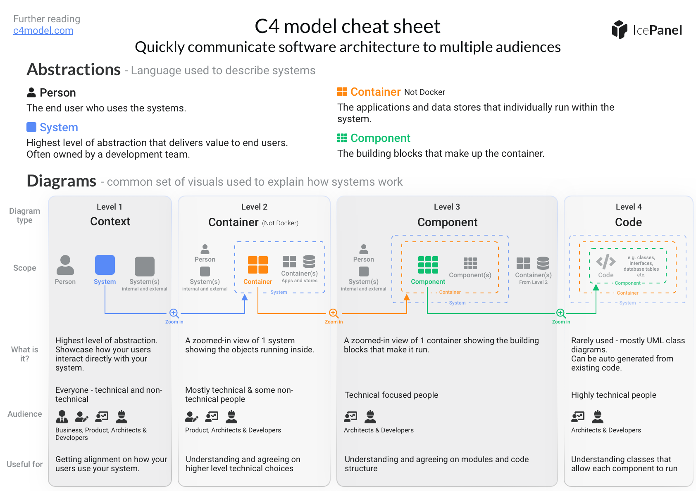

# Le modèle C4

Le modèle C4 est un modèle de représentation de l'architecture logicielle. Il est composé de 4 niveaux:

1. Contexte système
    - Considérer le système comme une boîte entourée d’utilisateurs, API, services tiers, etc.
    - But: comprendre qui/quoi interagit avec le système (information utile pour le client, les chefs de projet et les devs).
1. Conteneurs
    - Ce qu’il y a à l’intérieur du système: web apps, apps mobiles, bases de données, API, services en arrière-plan, bases de données, etc.
    - But: décomposer le système en unités déployables.
1. Composants
    - Définissez les blocs internes d’un conteneur (ex. les contrôleurs, les services, les routes, etc.).
    - But: montrer la structure interne (contrôleurs, services, utilitaires, etc.) utile pour les développeurs et pour définir l'architecture du code.
1. Code
    - Rarement utilisé, montrant la structure du code (classes, interfaces, fonctions, etc.).
    - But: utile pour les développeurs pour comprendre les détails d'implémentation.

Voici une infographie résumant le modèle C4 (source: [icepanel.io](https://assets.icepanel.io/blog/visualizing-software-architecture-with-the-c4-model/infographic.png)):

Voici quelques ressources pour en savoir plus:

- [Le site de online.visual-paradigm.com](https://online.visual-paradigm.com/diagrams/templates/c4-model/) propose des exemples de diagrammes C4 sur différents cas d'usage. Ils peuvent servir de base pour les katas.
- [Making Sense of Software Architecture with the C4 Model](https://dev.to/lovestaco/making-sense-of-software-architecture-with-the-c4-model-1814), explique les différents niveaux du modèle C4.
- [C4 model — a better way to visualise software architecture](https://medium.com/news-uk-technology/c4-model-a-better-way-to-visualise-software-architecture-df41e5ac57b8)
- [C4 Model. My experience + Example](https://itzareyesmx.medium.com/c4-model-my-experience-example-fbcf50def540)
