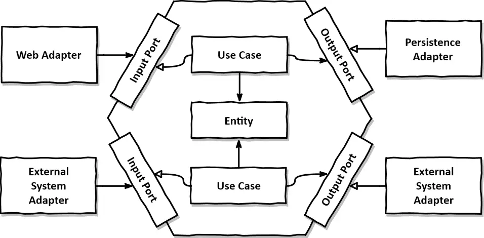

# Architecture de code

MVVM, MVC, Clean Architecture, Hexagonal Architecture, Onion Architecture, CQRS, Event Sourcing, Microservices, SOA, etc.

## Clean architecture

Proposée en 2012 par Robert C. Martin (Uncle Bob) dans son article [The Clean Architecture](https://8thlight.com/blog/uncle-bob/2012/08/13/the-clean-architecture.html) et développée dans son livre [Clean Architecture: A Craftsman's Guide to Software Structure and Design](https://www.oreilly.com/library/view/clean-architecture-a/9780134494272/).

### Différentes couches

Différentes représentations de la Clean Architecture :

### Flot

### Liens utiles :

- [.Net 9 clean architecture template](https://github.com/jasontaylordev/CleanArchitecture)
- [Understanding the difference between MVC architecture and Clean Architecture in ASP.NET](https://medium.com/@darshankrishan12/understanding-the-difference-between-mvc-architecture-and-clean-architecture-in-asp-net-0acd67228d1f)
- [Clean Architecture in .NET](https://medium.com/@stephanhoekstra/clean-architecture-in-net-8eed6c224c50)
- [Clean Architecture example in Java](https://github.com/mattia-battiston/clean-architecture-example)
- Non mis à jour depuis longtemps : [Clean Architecture template](https://github.com/mgdagpin/Arc)

## Architecture hexagonale

Proposée en 2005 par Alistair Cockburn.
Elle porte aussi le nom d'architecture en "Ports and Adapters".
Elle se compose de plusieurs couches organisées autour du domaine métier.

- Le domaine métier (core) au centre, qui contient la logique métier et les règles de l'application.
- Les ports, qui définissent les interfaces pour interagir avec le domaine métier.
- Les adaptateurs, qui implémentent les ports pour interagir avec des systèmes externes (bases de données, interfaces utilisateur, services externes, etc.).

### Liens utiles

- [Hexagonal Architecture with Java and Spring](https://reflectoring.io/spring-hexagonal/)
- [Hexagonal Architecture by Example](https://blog.allegro.tech/2020/05/hexagonal-architecture-by-example.html)
- [A Detailed Guide to Hexagonal Architecture with Examples](https://devcookies.medium.com/a-detailed-guide-to-hexagonal-architecture-with-examples-042523acb1db)