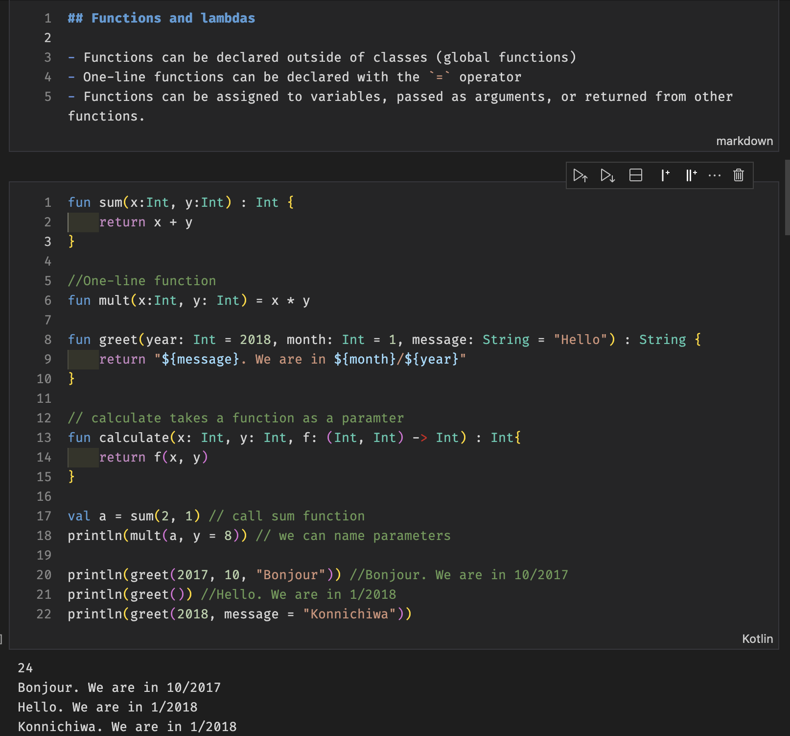
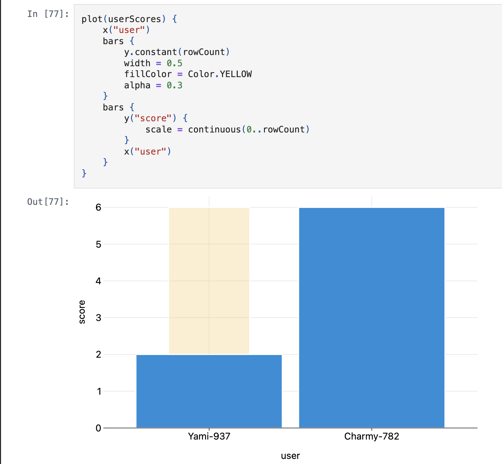
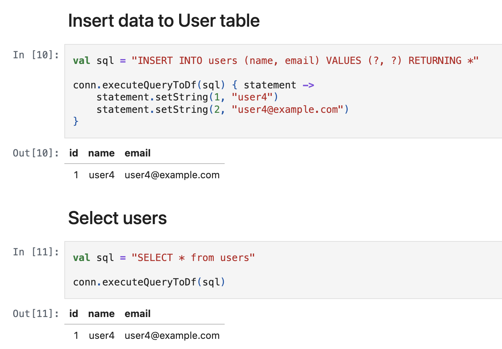

# Scripting with Kotlin

Kotlin is a modern and versatile programming language that is used for many targets and types of applications.
Although it is a compiled language at its core, Kotlin supports scripting, which enables small programs or scripts to be written and executed directly, providing a developer experience (DX) similar to other scripting languages. In this article, three ways of scripting with Kotlin are presented: using the `*.main.kts` file, using *kscript*, and using JBang. Kotlin notebooks are also mentioned as a bonus at the end.

<!-- more -->

## Scripting with `*.main.kts`

The official way to write Kotlin scripts is with a `*.main.kts` file, which is a special file that can be executed directly. Such a file may contain Kotlin code and can be run using the `kotlin` command. For example, a `script.main.kts` file may be created with the following content:

```kotlin
#!/usr/bin/env kotlin

println("Hello, Kotlin scripting!")
```

The script can be executed using the following command:

```sh
kotlin script.main.kts
```

"Hello, Kotlin scripting!" is printed to the console. The script may also be made executable by running:

```sh
chmod +x script.main.kts
```

and then run it with the following command:

```sh
./script.main.kts
```

Features such as debugging, implicit `argv` (command line arguments), and dependency management via `@file:DependsOn` and `@file:Repository` attributes (which must be placed at the top of the file) are provided by `*.main.kts` scripts. Caching support for fast execution is also available by default.

An example script that prints the last 10 posts from a given RSS feed URL is shown below. The use of the `@file:DependsOn` attribute to include dependencies, and the use of the `argv` variable to obtain command line arguments, are demonstrated in this example.

```kotlin
--8<--
blog/kotlin-script/rssreader.main.kts
--8<--
```

The script may be executed with the following command:

```sh
kotlin rssreader.main.kts [feed URL]
# For example:
kotlin rssreader.main.kts "https://blog.worldline.tech/index.xml"
```

The output of the script is similar to the following:

```text
Showing the last 10 posts from https://blog.worldline.tech/index.xml
- The Yoga of Image Generation – Part 3
- Insights from Onboarding young developers and Mentoring Experiences
- The Yoga of Image Generation – Part 2
- The Superpowers of JavaScript Proxies
- Devops on Google Cloud Platform: Automating your build delivery on GCP in nutshell
- Introduction to QEMU 386
- The Yoga of Image Generation – Part 1
- Proper key management in the cloud with a Cloud Secure Module
- The OAuth proxification guide for frontend developers with Microsoft EntraID
- Gemini, but the other one
```

Kotlin scripting with `*.main.kts` files is a straightforward way to write and execute Kotlin scripts.
This approach is available out of the box with the Kotlin compiler.
However, several limitations have been observed:
First, the `*.main.kts` file is currently only supported by IntelliJ IDEA, and a restart of the IDE may be required for dependencies to be recognized.
Second, scripts may not run with the `./script.main.kts` command due to the error `env: kotlin\r: No such file or directory`, which prevents execution. In such cases, the `kotlin script.main.kts` command must be used instead.
Lastly, the status of this feature is still experimental, so changes may occur in the future.
For further information, JetBrains has published a blog post about [the current state of Kotlin scripting by the end of 2024](https://blog.jetbrains.com/kotlin/2024/11/state-of-kotlin-scripting-2024/), which initially led to some doubts and misunderstandings about the future of official Kotlin scripting support. Ultimately, the feedback was related to other less successful and relevant scripting features being dropped.
Additional perspectives on the current state of official Kotlin scripting can be found in [InfoWorld](https://www.infoworld.com/article/3613358/kotlin-to-lose-scripting-features.html) and [Martin Bonin](https://mbonnin.net/2024-11-21_state-of-kotlin-scripting/) posts.

In addition to the official `*.main.kts` scripting, there are two other popular ways to write Kotlin scripts: using *kscript* and *JBang*.

## Scripting with kscript

kscript is an open-source tool designed to provide a user-friendly experience for writing Kotlin scripts.
It offers a command-line interface and features that simplify the process of writing and running Kotlin scripts.

After installing [kscript](https://github.com/kscripting/kscript?tab=readme-ov-file#installation), a script file with the `.kts` extension can be created, and the shebang line added at the top of the file.
For example, the following file, named `script.kts`, is a kscript file that prints "Hello, Kotlin scripting!" and takes a command line argument:

```kotlin
#!/usr/bin/env kscript

println("Hello, Kotlin scripting! ${args[0]}")
```

As with `*.main.kts` scripting, the script can be run using the `kscript` command:

```sh
kscript script.kts "from kscript"
```

The script may also be made executable by running:

```sh
chmod +x script.kts
```

and then run with the following command:

```sh
./script.kts "from kscript"
```

Features similar to the official `*.main.kts` scripting, such as dependency management and command line arguments, are provided by kscript. Additional developer-friendly features are also available, such as passing code from the command line. The following commands demonstrate two examples of passing code from the command line to kscript:

```sh
kscript 'println("hello world")'
echo 'println("Hello Kotlin.")' |  kscript -
```

kscript was advanced compared to the official Kotlin scripting support when it was in its early stages. However, many exclusive features of kscript have since been integrated into the official `*.main.kts` scripting, such as dependency management, command line arguments, and more. Additionally, kscript has not been updated for a long time, with the last release in July 2023.

A more feature-rich third-party Kotlin scripting experience can be achieved with JBang, as described in the next section.

## Scripting with JBang

JBang is a multipurpose tool designed for working with self-contained files for JVM languages (Java, Kotlin, etc.).
In addition to scripting, jars may be generated, executed, and scripts may be shared in a streamlined way.
For more details on JBang features aside from scripting, refer to my [blog post about JBang](https://blog.worldline.tech/2025/01/21/jbang.html), [my talk at Devoxx UK](https://www.youtube.com/watch?v=3QnwTmHGct8), and [the official website](https://www.jbang.dev/).
This section focuses on the scripting features of JBang.

The following commands demonstrate how JBang may be used to create and run a Kotlin script:

```sh
jbang init -t hello.kt hello-jbang.kt
# Execute the file
jbang hello-jbang.kt
# or like this
chmod +x hello-jbang.kt
./hello-jbang.kt
```

The `hello-jbang.kt` file is a regular Kotlin file with a main method.
It is considered a script due to the JBang annotation at the top of the file, also called a shebang, which instructs JBang to execute the file as a script.
The content of the file is as follows:

```kotlin
--8<--
blog/kotlin-script/hello-jbang.kt
--8<--
```

JBang supports all scripting features of `*.main.kts` with these additions:

- *File extension is .kt*: the same extension as regular Kotlin files. Thus, the file must have a main method.
- *Templates*: the ability to create scripts from predefined models.
- *Include other sources*: useful for sharing code between scripts.
- *Include resources*: if the code has resources, such as an app icon or a translation file.
- *Compiler and runtime options*: for customizing the behavior of the compiler and the runtime.

The following script demonstrates a Quarkus REST server written in Kotlin using JBang.
It uses the `//DEPS` feature to include dependencies.

```kotlin
///usr/bin/env jbang "$0" "$@" ; exit $?

//DEPS io.ktor:ktor-bom:3.0.1@pom
//DEPS io.ktor:ktor-server-netty-jvm
//DEPS io.ktor:ktor-serialization-jackson-jvm
//DEPS io.ktor:ktor-server-content-negotiation-jvm

import com.fasterxml.jackson.databind.SerializationFeature
import io.ktor.serialization.jackson.*
import io.ktor.server.application.*
import io.ktor.server.engine.*
import io.ktor.server.netty.*
import io.ktor.server.plugins.contentnegotiation.*
import io.ktor.server.response.*
import io.ktor.server.routing.*

data class Todo(val title: String, val isCompleted: Boolean)

fun main(args: Array<String>) {
    val todos = listOf(Todo("Sleep", false), Todo("Eat", true))
    print(todos)
    embeddedServer(Netty, 8080) {
        install(ContentNegotiation) {
            jackson {
                enable(SerializationFeature.INDENT_OUTPUT)
            }
        }
        routing { get("/") { call.respond(todos) } }
    }.start(wait = true)
}
```

It can be run with the following command, which downloads the script and runs it locally:

```sh
jbang ktor-rest@yostane
```

Once the server is running, it can be accessed at `http://localhost:8080`, which returns a JSON response with the list of todos:

```json
[
  {
    "title": "Sleep",
    "isCompleted": false
  },
  {
    "title": "Eat",
    "isCompleted": true
  }
]
```

JBang provides a versatile and feature-rich approach to writing Kotlin scripts.
It supports dependency management, templates, the ability to include other sources and resources, and many other features.
It also supports other JVM languages, such as Java and Groovy, making it a good choice for multi-language projects.
JBang is actively maintained and has a vibrant community, making it a reliable and robust tool for Kotlin scripting.
In my opinion, JBang is the best option for writing Kotlin scripts thanks to its comprehensive set of features and great developer experience.

The next section covers an alternative way of running Kotlin code blocks, which is not exactly scripting but is noteworthy.

## Bonus: Kotlin notebooks

Jupyter Notebook is a standard format for writing markdown, code, and the result of the code, all in a single file.
The extension of these files is `.ipynb` (interactive Python notebooks).
Notebooks are widely used for the following reasons:

- Code blocks may be written in any language, as long as a Jupyter Kernel for that language is installed. Although the extension of notebook files is ".ipynb" (for Python), it does not mean that only Python is supported.
- Code blocks may be executed in any order and independently, and a global session context retains the values of global variables across code block executions.
- Code and markdown blocks may be written in any order.
- Jupyter Notebooks are rendered properly by GitHub, GitLab, and many other tools and apps, including syntax highlighting and graphics and charts generated by code.

These features make Jupyter Notebooks suitable for writing documentation, experimentation, data science, and scripting.

Official support for Kotlin is available through the Kotlin Kernel, which allows Kotlin code blocks to be run inside Jupyter Notebooks.
The IntelliJ extension for Kotlin notebooks enables editing features found in regular Kotlin files (such as syntax highlighting and code suggestions).
VSCode also has a Kotlin extension for notebooks, but the language support is not as comprehensive (this may change with the [official Kotlin LSP](https://github.com/Kotlin/kotlin-lsp)).

The following screenshot shows a Kotlin notebook with a markdown block, a code block, and the result of the code block.



The notebook may be opened and edited with IntelliJ IDEA, VSCode, or any other Jupyter Notebook-compatible editor.
It can also be rendered on GitHub or GitLab.
The above notebook can be viewed on [GitHub at this link](https://github.com/worldline/learning-kotlin/blob/main/material/conferences/2025-03-26-voxxed-bucharest/01-language.ipynb).

Other screenshots of Kotlin notebooks are shown below:




([source gaplo917/awesome-kotlin-notebook](https://github.com/gaplo917/awesome-kotlin-notebook/blob/main/postgres/postgres-vanilla.ipynb))

Kotlin notebooks provide an interactive and visual way to write Kotlin code.
They are not exactly scripting, but may be used for scripting-like tasks, such as experimenting with code, writing documentation, and sharing code snippets.

## Conclusion

Kotlin is a powerful and versatile language.
In this post, three ways to write scripts with Kotlin have been explored: using the official `*.main.kts` scripting, using kscript, and using JBang.
JBang and the official approach each have their own advantages.
In my opinion, kscript is less recommended due to its lack of features and updates.

## References

- [May 2020: The state of Kotlin Scripting](https://mbonnin.medium.com/may-2020-the-state-of-kotlin-scripting-99cb6cc57db1)
- [November 2024: The state of Kotlin Scripting](https://mbonnin.net/2024-11-21_state-of-kotlin-scripting/)
