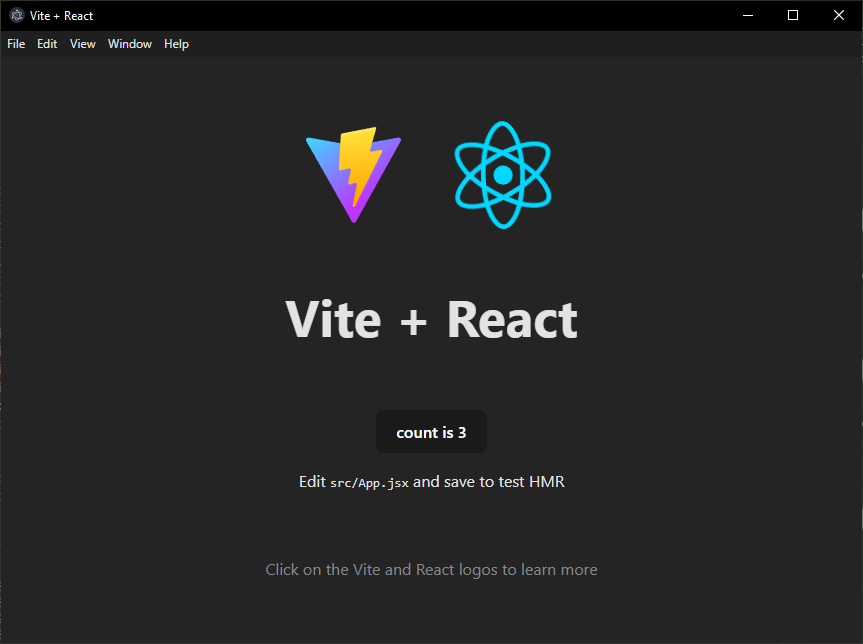

# ElectronJS

## Prise en main

Nous allons utiliser [Electron Forge](https://www.electronforge.io/)

```sh
# Création d'un projet en JavaScript
npx create-electron-app@latest my-app
# ou en TypeScript
npx create-electron-app my-app --template=vite-typescript
# Démarrer l'application
cd my-app
npm start
```

Cet outil permet de publier l'application sur les différentes plateformes (Windows, Mac, Linux).

```sh
# Génération du paquetage distribuable (installeur, dmg, etc.)
npm run make
# Publication sur certaines platrformes (GitHub, S3, etc.)
npm install --save-dev @electron-forge/publisher-github
npm run publish
```

Vous pouvez trouver plus d'infos sur [les makers ici](https://www.electronforge.io/config/makers) et [les
publishers ici](https://www.electronforge.io/config/publishers).

## preload et renderer

Electron est composé de deux processus: le processus principal (main) et le processus de rendu (renderer).

Le processus principal gère la fenêtre de l'application, tandis que le processus de rendu gère l'interface utilisateur. 

Le processus de rendu est isolé du système d'exploitation pour des raisons de sécurité, ce qui signifie qu'il ne peut pas accéder directement aux fonctionnalités du système d'exploitation.

Par défaut, le processus de rendu n'a pas accès à Node.js, ce qui signifie qu'il ne peut pas utiliser les modules Node.js pour accéder au système de fichiers, aux processus, etc. Il est possible de donner accès à Node.js au processus de rendu, mais cela peut poser des problèmes de sécurité. En revanche, il est recommandé d'utiliser un script de préchargement (preload) pour exposer uniquement les fonctionnalités nécessaires au processus de rendu.

## maker

Electron Forge utilise des "makers" pour générer les fichiers nécessaires à la distribution de l'application. Il existe différents makers pour différentes plateformes (Windows, Mac, Linux). Par exemple, le maker `@electron-forge/maker-squirrel` est utilisé pour générer un installeur pour Windows.

## Eletrong forge vite + React

Voici les étapes clés:

1. Créer un projet React avec Vite.
1. Créer un projet Electron + Vite avec Electron Forge.
1. Copier le code front de l'application React vers le projet Electron : écraser *index.html*, copier le dossier *public* et fusionner le contenu du dossier *src*.
1. Copier les configuration spécifique du projet React vers le projet Electron. Il ne devrait y avoir que le *eslint.json* à copier à la racine du projet Electron.
1. Ajouter le plugin `react()` dans *vite.renderer.config.(mjs ou ts)*. Vous pouvez le faire en remplaçant le contenu de ce fichier par le contenu de *vite.config.(js ou ts)* du projet React.
1. Copier les dépendances (`dependencies` et `devDependencies`) du projet React vers le projet Electron à part `vite`. Il ne devrait pas y avoir d'autres doublons, mais s'il y en a, il faut les supprimer.
1. Lancer l'application Electron. Si tout fonctionne, vous pouvez supprimer le projet React.

Voici les commandes qui permettent de faire ces étapes (fonctionne au moment où j'écris ces lignes sur un code JavaScript):

```sh
npx create-vite@latest my-react-app --template react
# En typescript
npx create-vite@latest my-react-app --template react-ts

npx create-electron-app@latest electron-react-app --template vite
# en typescript
npx create-electron-app@latest electron-react-app --template vite-typescript

cp my-react-app/index.html electron-react-app/index.html
cp -r my-react-app/public electron-react-app/public
cp -r my-react-app/src/* electron-react-app/src

cp my-react-app/eslint.config.js electron-react-app/eslint.config.js

cp my-react-app/vite.config.js electron-react-app/vite.renderer.config.mjs
# en typescript
cp my-react-app/vite.config.ts electron-react-app/vite.renderer.config.ts

cd electron-react-app
npm install react react-dom
npm install --save-dev @eslint/js @types/react @types/react-dom eslint vite-plugin-react @vitejs/plugin-react eslint-plugin-react-hooks eslint-plugin-react-refresh

npm start

# Sous un shell sh (bash, zsh, etc.)
rm -rf ../my-react-app
# Sous powershell
rm -Force -Recurse ../my-react-app
```


