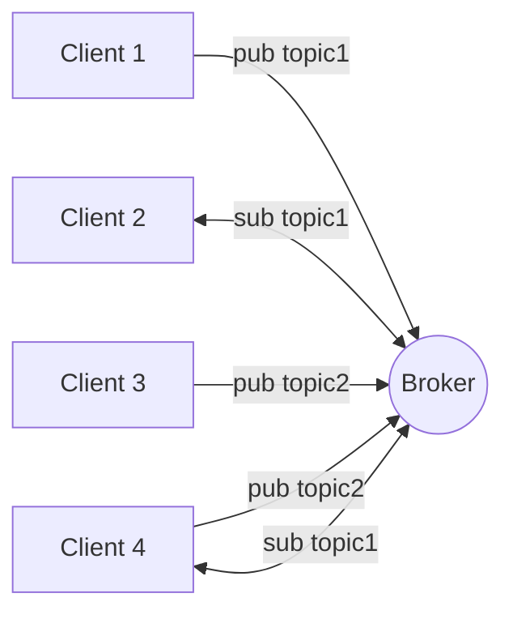

# Initiation au développement IoT

Voici les éléments que l'on va utiliser :

- **Capteurs et actionneurs** : on va utiliser une carte de développement munie de WiFi comme le ESP32-DevKitC V4.
    Celle-ci sera reliée à de capteurs et d'actionneurs.
- **Passerelle** : on va utiliser un serveur MQTT pour échanger des messages entre les capteurs et l'application.
- **Application** : on va développer une application web pour visualiser les données et envoyer des commandes.

## Brokers MQTT

MQTT suit le modèle de publication/abonnement (pub/sub) où les clients s'abonnent à des topics pour recevoir des messages et publient des messages sur des topics. Les clients peuvent êtres des capteurs, des actionneurs ou des applications.



Quelques brokers MQTT gratuits : [shiftr.io/cloud](https://www.shiftr.io/cloud/), [cloudamqp](https://www.cloudamqp.com/plans.html#rmq), [hivemq](https://www.hivemq.com/pricing/), [flespi](https://flespi.com/pricing).

- Créer un compte gratuit sur un des brokers MQTT ci-dessus. On prendra [hivemq](https://www.hivemq.com) pour cet exemple.
- Déployer une nouvelles instance de broker MQTT.
- Configurer un nouvel utilisateur et un mot de passe pour se connecter au broker.
- Tester le broker depuis le client web intégré ou depuis [mqttx](https://mqttx.app/).

### Développement d'un client MQTT Web

- Créer une application vanilla avec Vite : `npm create vite`
- Installer la librairie du client MQTT : `npm install mqtt`
- Ajouter un fichier `.env` qui contient l'URL de connexion. `VITE_MQTT_URL="wss://[identifiant]:[mdp]@[url_du_broker]:8884/mqtt"`
- Ajouter le contenu suivant dans le fichier `main.js` :

```js
import mqtt from 'mqtt'

const client = mqtt.connect(import.meta.env.VITE_MQTT_URL);

client.on('connect', asyync () => {
  console.log('connected')
  await client.subscribeAsync("test");
  await client.publishAsync("presence", "Client web connecté")
});

client.on('message', (topic, message) => {
  console.log('received', topic, message)
});
```

## Capteurs et actionneurs

On va utiliser une carte de développement ESP32 pour ce tutoriel.
Celle-ci est équipée de WiFi, de Bluetooth et de nombreux GPIO pour connecter des capteurs et des actionneurs.
Plus précisément, on va utiliser un simulateur de cette carte proposé par [wokwi.com](https://docs.wokwi.com/guides/esp32).


- Ouvrir la page [wokwi.com/micropython](https://wokwi.com/micropython) et explorer quelques exemples de projets pour comprendre comment ça marche.
- Si on souhaite démarrer un nouveau projet, [des modèles sont disponibles ici](https://docs.wokwi.com/guides/esp32#micropython)

## Sources et références

- Simulateur de carte de développement alternatif mais qui ne propose pas de ESP32 [tinkercad.com/circuits](https://www.tinkercad.com/circuits)
