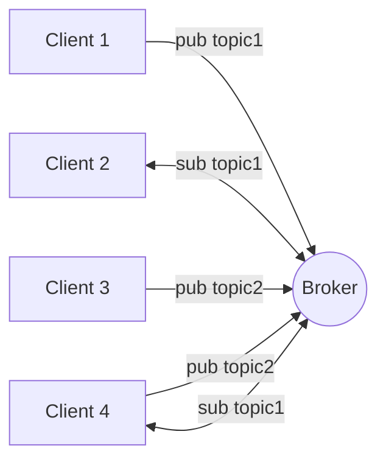

# Initiation au développement IoT

Voici les éléments que l'on va utiliser :

- **Capteurs et actionneurs** : on va utiliser une carte de développement munie de WiFi comme le ESP32-DevKitC V4.
    Celle-ci sera reliée à de capteurs et d'actionneurs.
- **Passerelle** : on va utiliser un serveur MQTT pour échanger des messages entre les capteurs et l'application.
- **Application** : on va développer une application web pour visualiser les données et envoyer des commandes.

## Brokers MQTT

MQTT suit le modèle de publication/abonnement (pub/sub) où les clients s'abonnent à des topics pour recevoir des messages et publient des messages sur des topics. Les clients peuvent êtres des capteurs, des actionneurs ou des applications.



Quelques brokers MQTT gratuits : [shiftr.io/cloud](https://www.shiftr.io/cloud/), [cloudamqp](https://www.cloudamqp.com/plans.html#rmq), [hivemq](https://www.hivemq.com/pricing/), [flespi](https://flespi.com/pricing).

- Créer un compte gratuit sur un des brokers MQTT ci-dessus. On prendra [hivemq](https://www.hivemq.com) pour cet exemple.
- Déployer une nouvelles instance de broker MQTT.
- Configurer un nouvel utilisateur et un mot de passe pour se connecter au broker.
- Tester le broker depuis le client web intégré ou depuis [mqttx](https://mqttx.app/).

## Développement d'un client MQTT Web

### Utilisation de la librairie MQTT

Nous allons créer une webapp qui se connecte au broker MQTT et qui peut envoyer un message et en recevoir sur le topic `"test"`.

- Créer une application vanilla avec Vite : `npm create vite`
- Installer la librairie du client MQTT : `npm install mqtt`
- Ajouter un fichier `.env` qui contient l'URL de connexion. `VITE_MQTT_URL="wss://[identifiant]:[mdp]@[url_du_broker]:8884/mqtt"`
- Ajouter le contenu suivant dans le fichier `main.js` :

    ```js
    import mqtt from 'mqtt'

    const client = mqtt.connect(import.meta.env.VITE_MQTT_URL);

    client.on('connect', asyync () => {
    console.log('connected')
    await client.subscribeAsync("test");
    await client.publishAsync("presence", "Client web connecté")
    });

    client.on('message', (topic, message) => {
    console.log('received', topic, message)
    });
    ```

- Lancer le serveur de développement : `npm run dev`
- Ouvrir la console du navigateur pour voir les messages reçus. Envoyer des messages depuis le client web intégré du broker vers le topic `"test"` pour les recevoir dans l'application (vérifier la console du navigateur).

### Utilisation de la librairie chart.js

Cette librairie permet d'afficher des graphiques en temps réel.
C'est très utile pour visualiser les données des capteurs.

- Installer la librairie : `npm install chart.js`
- Ajouter un canvas dans le fichier `index.html` :

    ```html
    <canvas id="myChart" width="400" height="400"></canvas>
    ```

- Dans `main.js`, initialiser un graph de type [line chart](https://www.chartjs.org/docs/latest/charts/line.html)
- S'abonner au topic `"temperature"`. On suppose que les messages reçus sont des nombres représentant la température. Les messages sont reçus au format texte brut (pas de JSON) comme `"25.5"`.
- A chaque réception d'un message dans le topic `"temperature"`, ajouter une nouvelle donnée au graphique comme indiqué dans [la documentation officielle](https://www.chartjs.org/docs/latest/developers/updates.html).

## Programmation embarquée

On va utiliser une carte de développement ESP32 pour ce tutoriel.
Celle-ci est équipée de WiFi, de Bluetooth et de nombreux GPIO pour connecter des capteurs et des actionneurs.
Plus précisément, on va utiliser un simulateur de cette carte proposé par [wokwi.com](https://docs.wokwi.com/guides/esp32).


- Ouvrir la page [wokwi.com/micropython](https://wokwi.com/micropython) et explorer quelques exemples de projets pour comprendre comment ça marche.
- Si on souhaite démarrer un nouveau projet, [des modèles sont disponibles ici](https://docs.wokwi.com/guides/esp32#micropython)
- [umqtt.simple](https://mpython.readthedocs.io/en/v2.2.1/library/mPython/umqtt.simple.html) est la librairie MQTT pour MicroPython.

### Quelques projets

- [ESP32 + LED](https://wokwi.com/projects/421877878949366785)
- [ESP32 + DHT22](https://wokwi.com/projects/421878757422340097)
- [LED + Bouton](https://wokwi.com/projects/423777988322853889)
- [Ecran SSD 1306](https://wokwi.com/projects/423777577384768513)
- [Contrôle d'une LED avec MQTT](https://wokwi.com/projects/421884645656923137)

??? "Connexion à un serveur MQTT en SSL/TLS"

    ```python
    --8<--
    iot/micropython/02-wokwi-esp32-samples/03-MQTT/main.py
    --8<--
    ```

### Travailler avec une vraie carte ESP32

- Flasher le firmware MicroPython sur la carte ESP32. Ce firmware fait deux choses : il installe un interprêteur Python intégrant la librairie MicroPython et il lance les fichiers `boot.py` et `main.py`, dans cet ordre, s'ils existent.
    - Sous Windows, installer les drivers USB pour la carte ESP32. Généralement, il s'agit du [**CP210x Universal Windows Driver** disponible ici](https://www.silabs.com/developer-tools/usb-to-uart-bridge-vcp-drivers) ou [via ce lien direct](https://www.silabs.com/documents/public/software/CP210x_Universal_Windows_Driver.zip).
    - Télécharger le firmware correspondant [à votre carte](https://micropython.org/download/?port=esp32). Pour la carte ESP32-VROOM, [la page de firmware is ici](https://micropython.org/download/ESP32_GENERIC/)
    - Installer esptool : `pip install esptool`
    - Tester la connexion avec la carte : `esptool.py flash_id` ou sous windows `esptool flash_id`
    - Réinitialiser la carte : `esptool.py erase_flash` ou sous windows `esptool erase_flash`
    - Flasher le firmware : `esptool.py write_flash 0x1000 fichier_firmware.bin` ou sous windows `esptool write_flash 0x1000 fichier_firmware.bin`
- Utiliser un IDE comme [mu Editor](https://codewith.mu/) ou Thonny pour écrire et exécuter le code MicroPython. Nous allons utiliser Mu pour cet exemple.
    - Connecter la carte à l'ordinateur via un câble USB.
    - Ouvrir le panneau fichier
- Installer des librairies et copier des fichiers sur l'ESP32 avec [`mpremote`](https://docs.micropython.org/en/latest/reference/mpremote.html)
    - Installer `mpremote` : `pip install mpremote`
    - Brancher l'ESP32 à l'ordinateur et fermer toute application l'utilisant (comme Mu)
    - Ouvrir un terminal classique (pas le REPL).
    - Vérifier que le port série est bien connecté : `mpremote connect list`
    - Installer une librairie avec [`mpremote mip`](https://docs.micropython.org/en/latest/reference/mpremote.html#mpremote-command-mip) : `mpremote mip install ssd1306`
    - Copier un fichier : `mpremote fs cp fichierlocal :destination`. Exemple: `mpremote fs cp main.py :main.py`

### Autres compétences à avoir pour faire de l'IoT

- [La soudure](https://www.framboise314.fr/comment-bien-souder-un-tutoriel-sur-la-soudure/)
- Les bases de l'électricité et l'électronique

### Lexique

- GND: (Ground) la terre ou le 0V
- VCC: (Voltage Common Collector) le +5V ou +3.3V. La tension d'alimentation.
- GP: (General Purpose) broche à usage général (broche I/O)

## Sources et références

- Simulateur de carte de développement alternatif mais qui ne propose pas de ESP32 [tinkercad.com/circuits](https://www.tinkercad.com/circuits)
- [Getting started with MicroPython on the ESP32](https://docs.micropython.org/en/latest/esp32/tutorial/intro.html)
