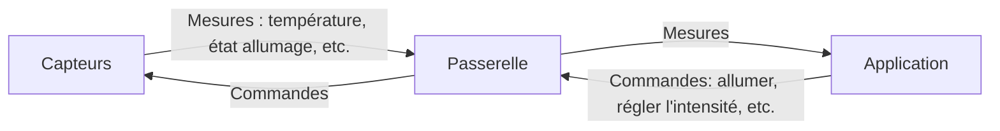
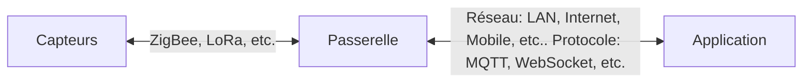
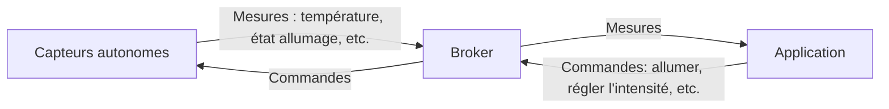
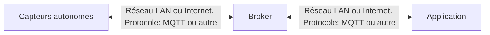
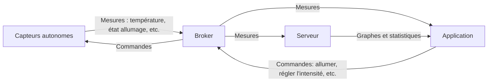

# IoT: Internet of Things

IoT est l'acronyme de l'expression anglaise "Internet of Things" qui signifie "Internet des objets".
Il s'agit d'un concept qui désigne l'interconnexion des objets du quotidien à internet.
Ces objets peuvent être des appareils électroménagers, des véhicules, des bâtiments, des objets portables, etc.
L'objectif de l'IoT est de permettre à ces objets de communiquer entre eux et avec des serveurs distants pour collecter, analyser et échanger des données.

## Principes de l'IoT

L'IoT repose sur plusieurs principes fondamentaux.
En voici quelques uns :

- **Interconnexion** : Les objets doivent être capables de communiquer entre eux et avec des serveurs distants.
- **Collecte et analyse de données** : Les objets doivent être capables de collecter des données sur leur environnement.
    Les données collectées doivent être analysées pour en extraire des informations utiles.
- **Automatisation** : Les objets doivent être capables de prendre des décisions et d'agir de manière autonome.
- **Sécurité** : Les données échangées entre les objets doivent être sécurisées pour éviter tout risque de piratage.
- **Intégration** : Les objets doivent être compatibles avec les standards de communication et d'interopérabilité.

## Applications de l'IoT

L'IoT trouve de nombreuses applications dans différents domaines.

- **Domotique** : Contrôle à distance des appareils électroménagers, chauffage, éclairage, etc.
- **Santé** : Suivi à distance de patients, monitoring de paramètres physiologiques, etc.
- **Agriculture** : Surveillance des cultures, gestion de l'irrigation, etc.
- **Industrie** : Maintenance prédictive, suivi des équipements, etc.
- **Ville intelligente** : Gestion des déchets, éclairage public, Suivi des véhicules, gestion du trafic, etc.

## Technologies de l'IoT

L'IoT repose sur plusieurs technologies clés.
En voici quelques unes :

- **Capteurs** : Permettent de collecter des données sur l'environnement.
- **Cloud computing** : Permet de stocker, traiter et analyser les données collectées.
- **Intelligence artificielle** : Permet d'analyser les données et de prendre des décisions de manière autonome.
- **Protocole réseau** : Permet aux objets de se connecter à internet de communiquer entre eux.
    On peut trouver du WiFi, du Bluetooth, du Zigbee, du LoRa, Ethernet, etc.
- **Protocole de communication** : Permet aux objets de communiquer entre eux et avec des serveurs distants.
    On trouve différents protocoles de communication comme MQTT, CoAP, HTTP, etc.

## Schéma classique d'un système IoT

Un système IoT est généralement composé des éléments suivants :

- **Capteurs** : Permettent de collecter des données sur l'environnement.
- **Actionneurs** : Permettent d'agir sur l'environnement en fonction des décisions prises.
- **Passerelle** : Permet de collecter les données des cap.
    Certains capteurs sont autonomes et peuvent communiquer directement avec un serveur.
- **Broker de message** : Permet d'échanger efficacement les différents éléments du système.
    Broker signifie courtier en français.
    Exemple de technologies de broker: MQTT, CoAP, etc.
- **Serveur(s)** : Permet de stocker, traiter et analyser les données collectées.
- **Application(s)** : Permet de visualiser les données et de prendre des décisions.

Plusieurs architectures sont possibles en fonction des besoins et des contraintes du système.
Voici deux exemples ci-dessous.

### Schéma typique avec passerelle et sans serveur

Voici un exemple de schéma où les capteurs communiquent avec une passerelle :

Voici un schéma qui montre les technologies utilisées

### Schéma typique sans passerelle avec un broker de message

Voici un exemple de schéma où les capteurs communiquent directement avec un serveur MQTT :

Voici un schéma qui montre les technologies utilisées

On peut aussi ajouter un serveur qui collecte les données et les stocke pour les analyser plus tard.

### Autres compétences à avoir pour faire de l'IoT

- [La soudure](https://www.framboise314.fr/comment-bien-souder-un-tutoriel-sur-la-soudure/)
- Les bases de l'électricité et l'électronique
