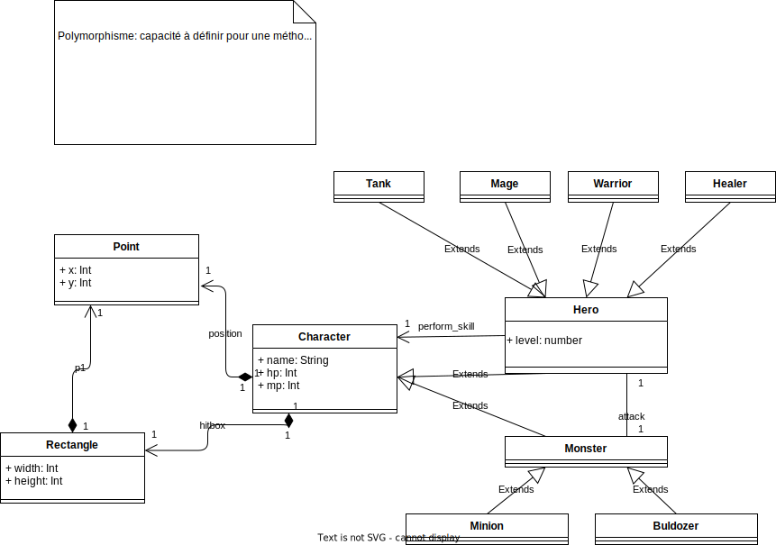

# Exercices en POO

!!! warning "Consignes"

    - Ne pas se faire aider par des IA ou genAI

## Série 1

1. Définir une classe `Personne` avec les attributs `nom`, `prenom` et `age`. Ajouter une méthode `afficher` qui affiche les informations de la personne. Implémenter les méthodes `__eq__` et `__str__`.
    - Créer quelques personnes et les afficher..
    - Afficher le résultat du `==`
1. On souhaite gérer un collection de consoles et jeux rétro avec la POO. Définir les classes `VideoGame` et `VideoGameConsole`. Chaque classe propose les propriétés: `name`, `releaseYear`. La classe `VideoGame` a en plus la propriété `developer` qui est la compagnie ou le développeur qui a développé le jeu. La classe `VideoGameConsole` a en plus la propriété `manufacturer` qui est la compagnie qui a fabriqué la console. Implémenter la méthode `__str__`.
    - Créer une liste `consoles` qui contient les consoles suivantes avec les `name`, `manufacturer` et `releaseYear` suivants:
        - DegaDrive, Dega, 1992.
        - Satourne, Dega, 1995.
        - Super Nontendo, Nontendo, 1991.
        - Nontendo, Nontendo, 1983.
        - Ponystation, Pony, 1996.
    - Créer une liste `games` qui contient les jeux suivants avec les `name`, `developer` et `releaseYear` suivants:
        - Sanic, Dega, 1991.
        - Spodermin, Morvel, 1992.
        - Y-Men, Morvel, 1993.
        - Nario, Nontendo, 1985.
        - Zebda, Nontendo, 1986.
        - First Fantasy, Rectangle, 1987.
        - Paper Gear, Bonami, 1987.
    - A partir de la liste `consoles`, afficher:
        - La liste des consoles fabriquées par Nontendo.
        - La liste des consoles sorties à partir du 1er janvier 1990.
    - A partir de la liste `games`, afficher:
        - La liste des jeux développés par Morvel.
        - La liste des jeux sortis à partir du premier janvier 1985.
1. Définir une classe `Point` qui possède deux propriétés x et y de type correspondant aux coordonnées du point.
    - Implémenter le constructeur `__init__(self, x, y)` qui permet d'initialiser les coordonnées.
    - Implémenter la méthode `__str__` qui représente le point de cette façon (ici, x = 2 et y = 3): `Point | x : 2 | y : 3`
    - Implémenter la méthode `translate(self, tx, ty)` qui ajoute `tx` à `x` et `ty` à `y`.
    - Implémenter la méthode `distance(self, point)` qui retourne la distance entre le point courant et le point passé en paramètre et retourne cela sous forme d'un point.
    - Instancier deux points et :
        - Afficher la distance entre les deux points.
        - Translater le premier point de 2 en x et 3 en y.
        - Afficher les deux points.
        - Afficher la nouvelle distance entre les deux points.
1. Définir une classe `BankAccount` modélisant un compte en banque. La classe possède deux propriétés initialisées dans le constructeur. `balance` correspond au solde du compte. `managementCost` qui correspond au frais de gestion du compte.
    - Implémenter le constructeur `__init__(...)`.
    - Implémenter la méthode `__str__(self)` qui affiche les informations du compte de cette façon: `Compte ( solde: 1000€ | frais de gestion: 13€ )`
    - Implémenter la méthode `debit(self, amount)` qui enlève `amount` au solde du compte uniquement si le solde est suffisant. Elle retourne un booléen qui renvoie `true` si le débit a réussi, sinon `false`.
    - Implémenter la méthode `send(self, bankAccount, amount)` qui transfère de l'argent vers un autre compte uniquement si le solde est suffisant. La méthode retourne un booléen calculé de la même façon que la méthode `debit`.
    - Instancier deux comptes et effectuer des opérations de débit et de transfert. Afficher l'état de réussite de chaque opération et l'état des comptes après chaque opération.
1. On souhaite générer des prédictions météorologiques sur une durée de 30 jours et faire des traitements dessus. Définir la classe `WeatherForecast` avec la propriété `day` (entier entre 1 et 30) et `temperature` (entier qui représente la température en Celsius).
    - Implémenter le constructeur
    - Implémenter la méthode `to_farhenheit(self)` qui retourne la température en Fahrenheit avec la formule suivante: `F = C * 9/5 + 32`
    - Implémenter la méthode `__str__` qui affiche la prévision de cette façon: `Jour 1: 20°C | 68°F`
    - Instancier une liste de de 30 prévisions pour chacun des jours avec des températures aléatoires sous forme d'entier entre -10 et 40 degrés.
    - Calculer les résultats suivants sans utiliser `avg`, `min`, `max`.
        - La température moyenne sur les 30 jours.
        - La température la plus faible ainsi que les jours où cette température a été enregistrée. Par exemple si la température la plus faible est -10, on doit afficher les jours où -10 a été enregistré.
        - La température la plus élevée ainsi que les jours où cette température a été enregistrée.
        - Afficher les prévisions triées par température croissante avec et sans utiliser les méthodes de tri prédéfinies.
        - Afficher les prévisions triées par température décroissante avec et sans utiliser les méthodes de tri prédéfinies.
        - Le nombre de jours où la température est supérieure à 20°C et le nombre de jours où la température est inférieure à 0°C.
        - Un dictionnaire qui compter le nombre prévisions qui ont les mêmes températures. Par exemple si 5 jours ont une température de `20°C`, et les reste des jours ont `-5°C` le dictionnaire sera `{"20°C": 5, "-5°C": 25}`.
1. Générateur de personnage RPG et un simulateur de combat.
    - Définir la classe `Character` avec les attributs `name`, `level`, `attack` et `health`. Implémenter une méthode `attack(self, target)` (où target est un `Character`) qui diminue la santé de la cible. Ajouter une méthode `is_alive(self)` qui retourne `True` si le personnage est vivant, `False` sinon. Implémenter le constructeur qui initialise les attributs `name`, `level`, `attack` (entier aléatoire entre 1 et 5) et `health` (entier aléatoire entre 10 et 20). Implémenter une méthode `heal(self)` qui rétablit `health` de `5 + level // 10` (// est la division entière).
    - Définir la fonction `fight(character1, character2)` qui simule un combat entre deux personnages. Le combat se déroule de la façon suivante:
        - Tant que les deux personnages sont vivants, ils s'attaquent à tour de rôle.
        - Le personnage 1 attaque le personnage 2, puis le personnage 2 attaque le personnage 1.
        - L'attaque de p1 envers p2 diminue le `health` de p2 avec la formule suivante `p2.health - p1.attack * (réel aléatoire entre 0.75 et 1.25)`.
        - Le déroulement du combat est affiché au fur et à mesure.
        - `health` doit toujours être >= 0
    - Définir la fonction `fight_alternative(character1, character2)` qui reprend le même algo que `fight`, mais permet au joueur actuel d'appeler sa méthode `heal` en plus d'attaquer. La méthode `heal` est appelée si un nombre aléatoire en 50 et 100 généré au moment où son tour débute est strictement inférieur à son `(numéro du tour * level) / health`. Par exemple, si le joueur 1 a un niveau de 5 et 2 points de vie et qu'au tour 30, le nombre aléatoire est 60, alors le joueur 1 peut se soigner car `(30 * 5) / 2  = 75 est supérieur à 60`. Par contre, si le nombre aléatoire généré était de 75 ou plus, alors le joueur ne peut pas se soigner.
1. Définir une classe `Book` avec les propriétés suivantes Python: `nb_pages: number,`title`: string,`author`: string,`isbn`: string` ([ISBN (The International Standard Book Number)](https://en.wikipedia.org/wiki/ISBN)) et `marked_page: number`.
    - Dans la classe `Book`, définir une méthode `mark_page(self, page)` qui permet de mettre à jour la valeur de `marked_page` avec la valeur de l'argument `page`. ⚠ bien vérifier que `page` soit < à `nb_pages`.
    - Créer une classe `Library` (Bibliothèque) qui contient un tableau de livres qui est passé au constructeur. ⚠ Il y'a une relation entre `Library` et `Book` mais ce n'est pas une relation d'héritage. Pour ce cas, on dit que c'est une **agrégation**.
    - Dans la classe `Library`, définir une méthode `list_authors()` qui retourne un tableau contenant uniquement les noms des auteurs.
    - Dans la classe `Library`, définir une méthode `sum_of_marked_pages()` qui retourne la somme des `marked_page` de tous les livres.
    - Instancier une `Library` avec trois livres
    - Afficher les résultats des appels des méthodes `list_authors()` et `sum_of_marked_pages()`.
    - Est-ce que la classe `Book` peuvent exister et être utilisée indépendamment de `Library` ?

??? "Solution Person"

    ```python
    --8<--
    python/poo/ex_person.py
    --8<--
    ```

??? "Solution Retro games and consoles"

    ```python
    --8<--
    python/poo/ex_retro_game_lib.py
    --8<--
    ```

## Série 2

1. Donner deux exemples de relation d'héritage à un niveau.
    - Par exemple l'étudiant est une personne.
1. Donner deux exemples de relation d'héritage à deux niveaux.
    - Par exemple : un téléphone est un appareil électronique, un appareil électronique est un appareil.
1. Trouver les relations d'héritage possibles pour chacun de ses groupes de classes (traiter chaque ligne indépendamment):
    - `Être vivant`, `Homme`, `Animal`
    - `Meuble`, `Fauteuil`, `Armoire`, `Table`.
    - `Aliment`, `Pâtisserie`, `Mille-Feuilles`, `Croissant`, `Pain`, `Fruit`, `Pomme`, `Banane`
    - Aucun code python n'est demandé.
1. Donner une classe parente pour chaque groupe de classes (traiter chaque ligne indépendamment):
    - Ordinateur portable, ordinateur fixe
    - Ordinateur portable, ordinateur fixe, Switch, Xbox, Playstation
    - Voiture, Camion, Vélo, Trottinette
1. Un *fermier* élève des *animaux* et cultive des *fruits*. Il a des vaches, des poules, des pommes, des poires, des bananes et des fraises. Définir les classes en UML et les coder en Python.
1. Un *garage* répare des *véhicules* et vend des *pièces*. Il répare des voitures, des camions, des vélos et des trottinettes. Il vend des pneus, des moteurs, des batteries et des phares. Définir les classes en UML et les coder en Python.
1. Répondre aux questions suivantes :
    - L'héritage correspondant à une relation **être** ou **avoir** ?
    - Donner deux avantages de l'héritage.
    - Est-ce que `t` est un objet, classe ou une instance `t = Shell()` ?
    - Que représente `super()` en Python ?

??? Solutions

    - Exemples de relation d'héritage à un niveau :
        - `Personne` hérite de `Être vivant`.
        - `Homme` hérite de `Personne`.
    - Exemples de relation d'héritage à deux niveaux :
        - `Téléphone` hérite de `Appareil électronique` qui hérite de `Appareil`.
        - `Véhicule` hérite de `Moyen de transport` qui hérite de `Objet mouvant`.
    - Relations d'héritage possibles :
        - `Être vivant` est une classe parente de `Homme` et `Animal`.
        - `Meuble` est une classe parente de `Fauteuil`, `Armoire` et `Table`.
        - `Aliment` est une classe parente de `Pâtisserie`, `Fruit` et `Pain`.
    - Classe parente pour chaque groupe de classes :
        - `Ordinateur` est une classe parente de `Ordinateur portable` et `Ordinateur fixe`.
        - `Appareil électronique` est une classe parente de `Ordinateur portable`, `Ordinateur fixe`, `Switch`, `Xbox` et `Playstation`.
        - `Objet mouvant` est une classe parente de `Voiture`, `Camion`, `Vélo` et `Trottinette`.
    - Questions
        - L'héritage correspondant à une relation **être**.
        - Deux avantages de l'héritage:
            - Réutilisation du code.
            - Factorisation du code.
        - `t` est une instance de la classe `Shell` ou un objet de type `Shell`.
        - `super()` permet d'appeler une méthode de la classe parente.
    
    ```py title="Fermier"
    --8<--
    ex_farmer.py
    --8<--
    ```

## Série 3

1. Définir la classe `StringUtils` qui contient les méthodes statiques suivantes:
    - `is_palindrome(word: str) -> bool` qui retourne `True` si le mot est un palindrome, `False` sinon
    - `count_vowels(word: str) -> int` qui retourne le nombre de voyelles dans le mot
    - `count_uppercase(word: str) -> int` qui retourne le nombre de majuscules dans le mot
    - `count_lowercase(word: str) -> int` qui retourne le nombre de minuscules dans le mot
    - Appeler les différentes méthodes de cette classe
1. Définir la classe `TaxUtils` qui contient les méthodes statiques suivantes:
    - `compute_ttc(price_ht: float, vat_rate: float) -> float` qui retourne le montant TTC
    - `compute_tva(price: float, vat_rate: float) -> float` qui retourne le montant de la TVA
    - Appeler les différentes méthodes de cette classe
1. Définir la classe abstraite `Shape` qui contient les méthodes abstraites suivantes:
    - `area() -> float` qui retourne l'aire de la forme
    - `perimeter() -> float` qui retourne le périmètre de la forme
    - Définir les classes `Rectangle`, `Circle` et `Triangle` qui héritent de `Shape` et implémentent les méthodes abstraites.

??? "Solutions"

    ```py title="StringUtils.py"
    --8<--
    StringUtils.py
    --8<--
    ```

## Série 4

1. Nous souhaitons définir les classes d'un futur jeu MOBA qui va cartonner sévère. Le jeu sera en 2D en vue du dessus. Dans ce jeu nous aurons des héros qui affrontent des monstres.
    - Les héros et les monstres ont tous des HP (points de vie), des MP (points de magie), un nom, une position dans la carte et une *hitbox* (rectangle de détection des dégâts).
    - Un héro peut être soit un tank, soit un mage, soit un soigneur ou soit un guerrier. Chaque héro a un niveau et une compétence propre (le héros fait 10 dégâts, le mage fait 20 dégâts et perd 5 mp, le tank donne 2 de ses hp et le soigneur fait gagner 30 hp et perd 8 mp). Tous les héros commencent au niveau 1 avec des valeurs de HP et MP aléatoires compris entre 100 et 200 et entre 50 et 100 respectivement. Les guerriers commencent avec 0 MP.
    - Un monstre peut être soit un minion, soit un buldozer. Les monstres ont 0 MP et ont des hp aléatoires compris entre 30 et 70.
    - Représenter les différentes classes en UML et les coder en Python.

??? "Solution moba"

    

    ```py
    --8<--
    ex_moba.py
    --8<--
    ```
