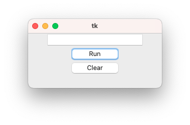

# Tkinter

[Tkinter](https://docs.python.org/3/library/tkinter.html) is a graphical library for Python. It allows you to create graphical user interfaces (GUIs) in a simple and quick manner.

## Getting Started

On macOS, you might need to install the library with `pip install tk`.

```py title="Basic Window"
--8<--
hello_tk_01.py
--8<--
```


```py title="Two Buttons and a Text"
--8<--
hello_tk_02.py
--8<--
```


## TTk

The `ttk` components are improved components of Tkinter. They are more modern, more visually appealing, and better adapt to the OS (Operating System). For example, they use the colors of the OS theme (such as dark mode).

```py title="ttk Components"
--8<--
hello_tk_02bis.py
--8<--
```


## Editable Text

```py title="Editable Text"
--8<--
hello_tk_03.py
--8<--
```



```py title="Editable Text + Adding Content on the Fly"
--8<--
hello_tk_04.py
--8<--
```


